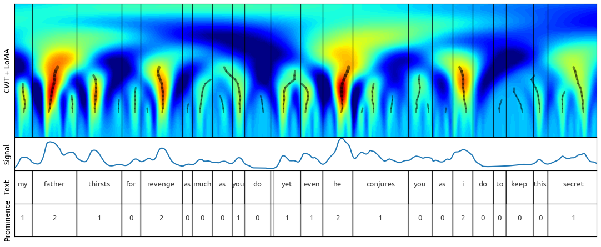

# Predicting Prosodic Prominence from Text with Pre-Trained Contextualized Word Representations

This repository contains the Helsinki Prosody Corpus and the code for the paper:

Aarne Talman, Antti Suni, Hande Celikkanat, Sofoklis Kakouros, Jörg Tiedemann and Martti Vainio. 2019 (forthcoming). [Predicting Prosodic Prominence from Text with Pre-trained Contextualized Word Representations](). *Proceedings of NoDaLiDa*. 
 
**Abstract:**  *In this paper we introduce a new natural language processing dataset and benchmark for predicting prosodic prominence from written text. To our knowledge this will be the largest publicly available dataset with prosodic labels. We describe the dataset construction and the resulting benchmark dataset in detail and train a number of different models ranging from feature-based classifiers to neural network systems for the prediction of discretized prosodic prominence. We show that pre-trained contextualized word representations from BERT outperform the other models even with less than 10% of the training data. Finally we discuss the dataset in light of the results and point to future research and plans for further improving both the dataset and methods of predicting prosodic prominence from text. The dataset and the code for the models are publicly available.*

If you find the corpus or the system useful, please cite: 

```
@inproceedings{talman_etal2019prosody,
  author = {Aarne Talman and Antti Suni and Hande Celikkanat and Sofoklis Kakouros 
            and J\"org Tiedemann and Martti Vainio},
  title = {Predicting Prosodic Prominence from Text with Pre-trained Contextualized 
           Word Representations},
  booktitle = {Proceedings of NoDaLiDa},
  year = {2019}
}
```

## The Helsinki Prosody Corpus

**License**: CC BY 4.0

This repository contains the largest annotated dataset with labels for prosodic prominence. 

* **Download:** The corpus is available in the [data](https://github.com/Helsinki-NLP/prosody/tree/master/data) folder. Clone this repository or download the files separately.  

The prosody corpus contains automatically generated, high quality prosodic annotations for the recently published [LibriTTS corpus](https://arxiv.org/abs/1904.02882) using the Continuous Wavelet Transform Annotation method and the [Wavelet Prosody Analyzer toolkit](https://github.com/asuni/wavelet_prosody_toolkit).


Image: Continuous Wavelet Transform Annotation method

### Corpus statistics

| Datasets    |  Speakers  |  Sentences  |  Words     |  Label: 0  |  Label: 1 |  Label: 2 |
| ---         | ---        | ---         | ---        | ---        | ---       | ---       |
| train-100   |  247       |   33,041    |  570,592   |  274,184   |  155,849  |  140,559  |
| train-360   |  904       |  116,262    |  2,076,289 |  1,003,454 |  569,769  |  503,066  |
| dev         |  40        |  5,726       |  99,200    |  47,535    |  27,454   |  24,211   |
| test        |  39        |  4,821       |  90,063    |  43,234    |  24,543   |  22,286   |
| **Total:**  |  **1230**  |  **159,850**    |  **2,836,144** |  **1,368,407** |  **777,615**  |  **690,122**  |

### Format

The corpus contains data in text files with one word per line and sentences
separated with an empty line. Each non-empty line has five items separated with tabs in
the following order:
* word
* discrete prominence label: 0, 1, 2 (NA for punctuation)
* discrete word boundary label: 0, 1, 2 (NA for punctuation) **BETA**
* real-valued prominence label (NA for punctuation)
* real-valued word boundary label (NA for punctuation) **BETA**

**Example:**
```
commercial    2    1    1.679    0.715
```

## System

**License**: MIT

To use the system following dependencies need to be installed:

* Python 3
* PyTorch>=1.0
* argparse
* pytorch_transformers
* numpy

To install the requirements run:

```console
pip3 install -r requirements.txt
```

To download the word embeddings for the LSTM model run:
```console
./download_embeddings.sh

```

### Models included:
* BERT
* LSTM
* Majority class per word
* See *model.py* for the complete list

For the **BERT** model run training by executing:

```console
# Train BERT-Uncased
python3 main.py \
    --model BertUncased \
    --train_set train_360 \
    --batch_size 32 \
    --epochs 2 \
    --save_path results_bert.txt \
    --log_every 50 \
    --learning_rate 0.00005 \
    --weight_decay 0 \
    --gpu 0 \
    --fraction_of_train_data 1 \
    --optimizer adam \
    --seed 1234
```

For the **Bidirectional LSTM** model run training by executing:
```console
# Train 3-layer BiLSTM
python3 main.py \
    --model BiLSTM \
    --train_set train_360 \
    --layers 3 \
    --hidden_dim 600 \
    --batch_size 64 \
    --epochs 5 \
    --save_path results_bilstm.txt \
    --log_every 50 \
    --learning_rate 0.001 \
    --weight_decay 0 \
    --gpu 0 \
    --fraction_of_train_data 1 \
    --optimizer adam \
    --seed 1234
```


### Output

Output of the system is a text file with the following structure:

```
<word> tab <label> tab <prediction>
```

Example output:
```
And    0     0
those  2     2
who    0     0
meet   1     2
in     0     0
the    0     0
great  1     1
hall   1     1
with   0     0
the    0     0
white  2     1
Atlas  2     2
?      NA    NA
```

## Baseline Results

Main experimental results from the paper using the *train-360* dataset.

|    Model                 |  Test accuracy (2-way)  |  Test accuracy (3-way) |
| ---                      | ---                     | ---                    |
| BERT-base                |  **83.2%**                  |  **68.6%**                 |
| 3-layer BiLSTM           |  82.1%                  |  66.4%                 | 
| CRF ([MarMoT](http://cistern.cis.lmu.de/marmot/)) |  81.8%                  |  66.4%                 |
| SVM+GloVe ([Minitagger](https://github.com/karlstratos/minitagger))  |  80.8%                  |  65.4%                 |
| Majority class per word  |  80.2%                  |  62.4%                 |
| Majority class           |  52.0%                  |  48.0%                 |
| Random                   |  49.0%                  |  39.5%                 |

## Contact

Aarne Talman: [aarne.talman@helsinki.fi](mailto:aarne.talman@helsinki.fi)
